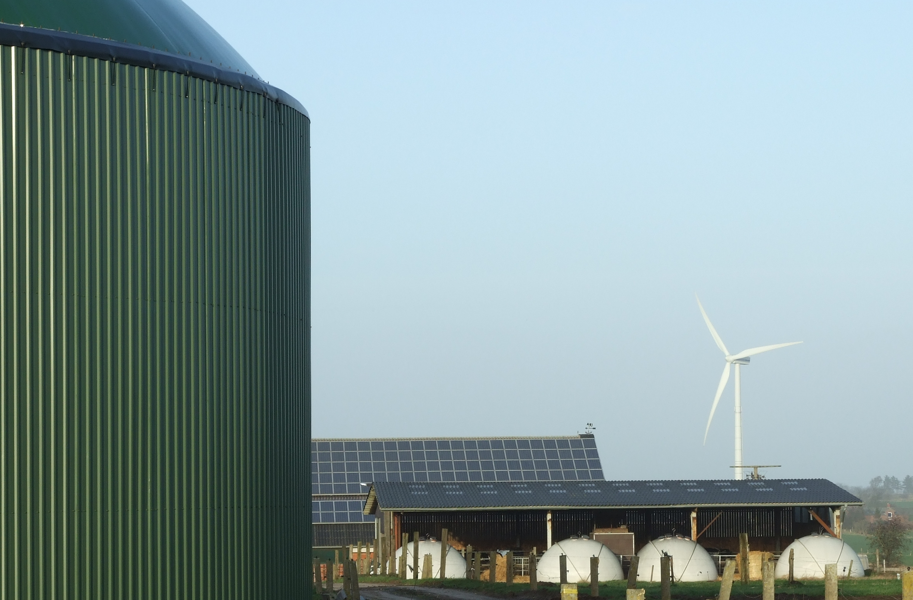
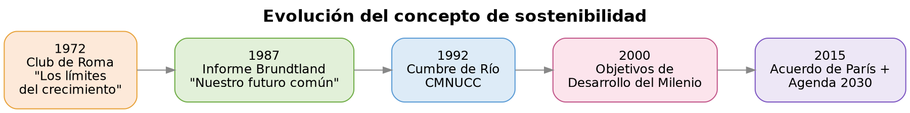
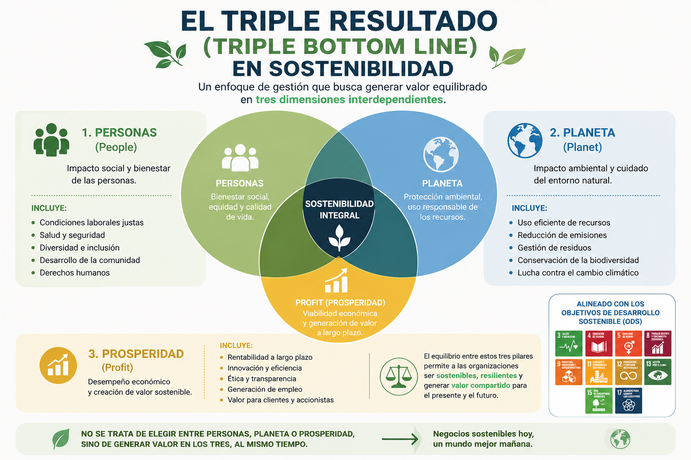
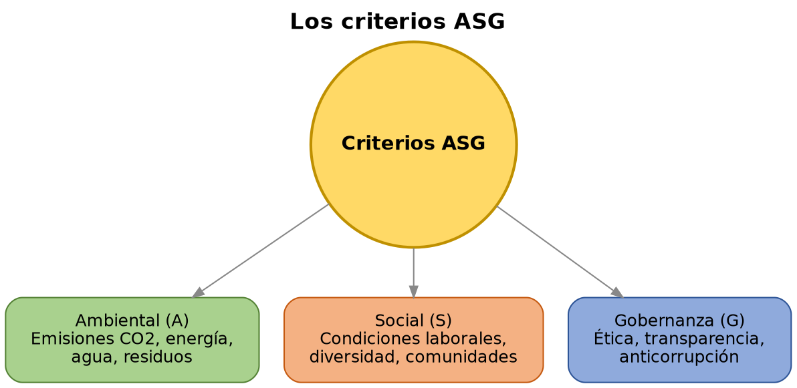
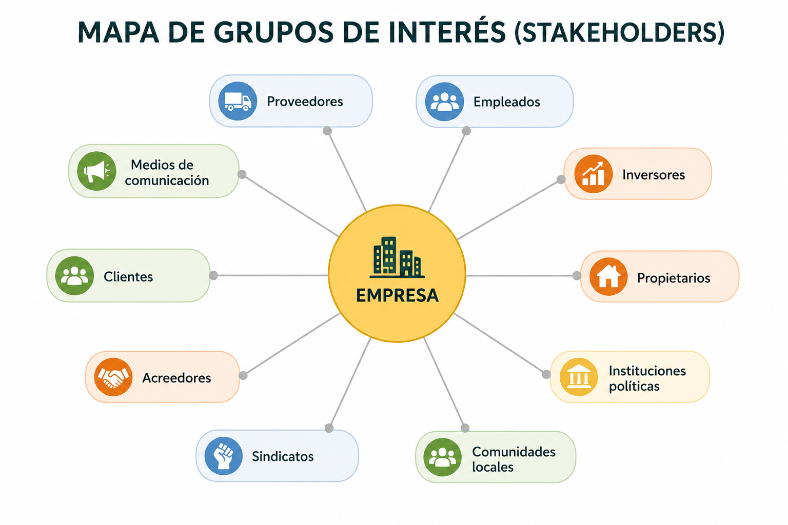
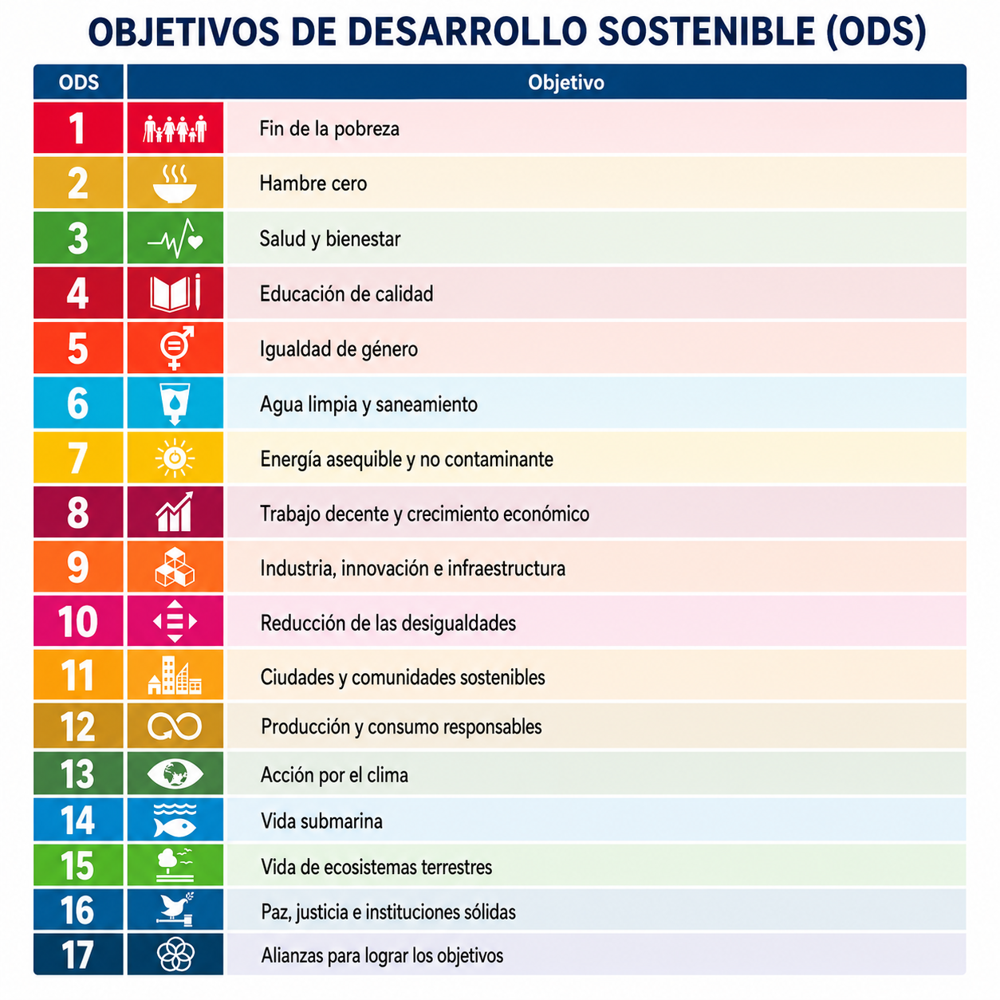
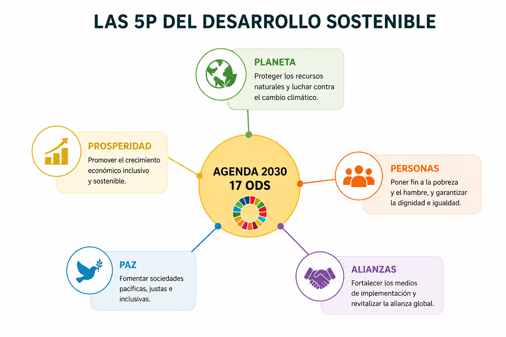
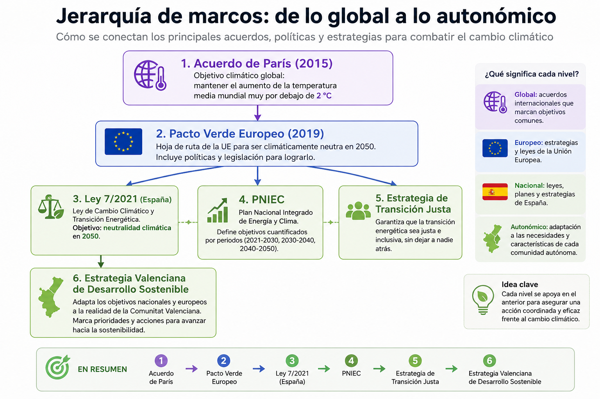
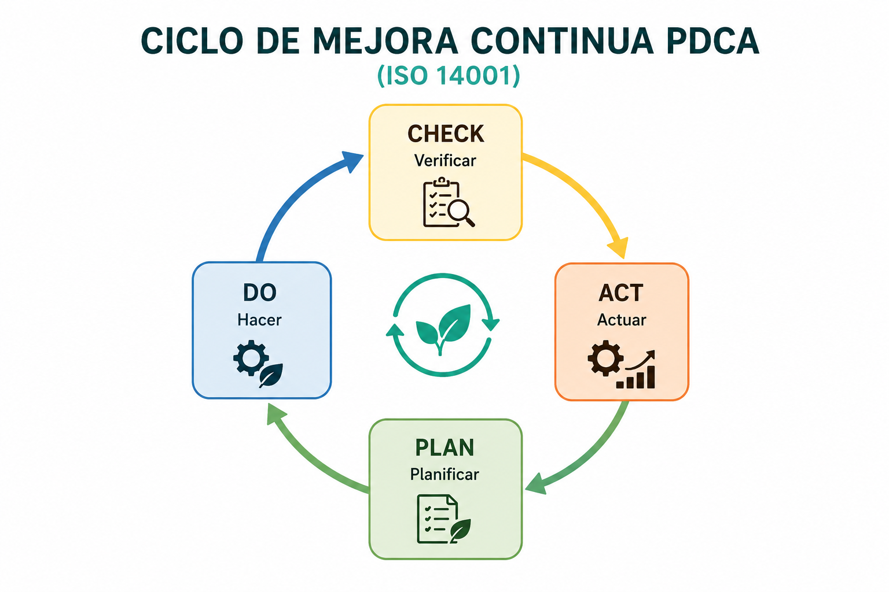
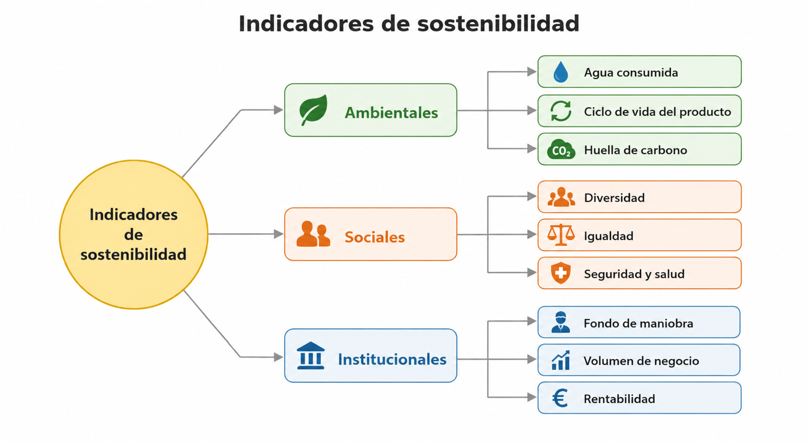

# UD1 — Sostenibilidad, ASG y marcos internacionales

*Foto: Andy Dingley (edición: Muhammad Mahdi Karim), [CC BY-SA 3.0](https://creativecommons.org/licenses/by-sa/3.0/), vía [Wikimedia Commons](https://commons.wikimedia.org/wiki/File:Barrow_Offshore_wind_turbines_NR.jpg)*

---

## 1. Origen y evolución del concepto de sostenibilidad

**¿Qué es la sostenibilidad?**

La sostenibilidad es la capacidad de un sistema — económico, social o ambiental — de mantenerse en el tiempo sin agotar los recursos ni degradar las condiciones de las que depende para seguir existiendo. Aplicada a una organización, significa generar valor de forma que eso no comprometa su propia capacidad de seguir generándolo en el futuro, ni la de las personas, comunidades o ecosistemas de los que depende.

En términos más concretos, la sostenibilidad busca:

- Aumentar el bienestar de las personas en el presente.
- Sin comprometer el bienestar de las generaciones futuras.
- Una mejora continua de la calidad de vida colectiva, no un estado fijo ya alcanzado.
- El equilibrio entre crecimiento económico, respeto ambiental y bienestar social — la misma idea que retomaremos como Triple Bottom Line en el punto 2.

El concepto de sostenibilidad no nace de golpe en un único documento: es el resultado de varias décadas de debate internacional sobre los límites del crecimiento económico.

| Año | Hito | Aportación |
|---|---|---|
| 1972 | Informe *Los límites del crecimiento* (Club de Roma) | Primera advertencia con base en modelos matemáticos de que el crecimiento económico y demográfico ilimitado choca con recursos naturales finitos |
| 1987 | Informe Brundtland *Nuestro futuro común* (ONU) | Define por primera vez "desarrollo sostenible": *el que satisface las necesidades del presente sin comprometer la capacidad de las generaciones futuras de satisfacer las suyas* |
| 1992 | Cumbre de la Tierra de Río de Janeiro | Primer gran tratado internacional (Convención Marco de Naciones Unidas sobre el Cambio Climático — CMNUCC); nace el concepto de "desarrollo sostenible" como política de Estado |
| 2000 | Objetivos de Desarrollo del Milenio (ODM) | 8 objetivos con horizonte 2015, centrados sobre todo en pobreza y desarrollo social; predecesores directos de los ODS |
| 2015 | Acuerdo de París + Agenda 2030 (mismo año) | Consolidación del marco actual: objetivo climático global (París) + marco de desarrollo sostenible integral (ODS) |

**Idea clave:** la sostenibilidad pasó de ser una preocupación ambiental aislada (años 70) a un marco integral que abarca economía, sociedad y gobernanza (desde los años 90 hasta hoy).

## 2. El triple resultado (Triple Bottom Line) y las tres dimensiones

En 1994, John Elkington acuñó el concepto de **Triple Bottom Line** (*People, Planet, Profit*): una empresa sostenible no se mide solo por su beneficio económico, sino por el balance conjunto de sus resultados económicos, sociales y ambientales.

De ahí derivan las tres dimensiones clásicas de la sostenibilidad:

- **Dimensión ambiental** — capacidad de los ecosistemas de absorber la actividad humana sin degradarse de forma irreversible.
- **Dimensión social** — equidad, derechos humanos, condiciones laborales dignas, cohesión de las comunidades.
- **Dimensión económica** — viabilidad financiera real, sin trasladar costes ocultos (externalidades) al medio ambiente o a la sociedad.

**Ejemplos reales por dimensión** (para ver que no son categorías abstractas):

| Dimensión | Empresa | Acción concreta |
|---|---|---|
| Ambiental | Grupo Bimbo | Reduce su impacto mediante agricultura regenerativa en su cadena de suministro |
| Social | CEMEX | Favorece programas de autoconstrucción para lograr vivienda digna en comunidades vulnerables |
| Económica | Unilever | Crece apoyándose en sostenibilidad: reciclaje de envases, uso de materiales reciclados, campañas de consumo responsable |

**Sostenibilidad débil vs. sostenibilidad fuerte:**
- La *sostenibilidad débil* asume que el capital natural (recursos, ecosistemas) puede sustituirse por capital construido (tecnología, infraestructura) sin pérdida neta de bienestar.
- La *sostenibilidad fuerte* sostiene que hay funciones ecológicas críticas (clima estable, biodiversidad, agua dulce) que no tienen sustituto tecnológico y deben protegerse como límites no negociables (concepto de "límites planetarios", Rockström et al., 2009).

## 3. Los criterios ASG (Ambiental, Social, Gobernanza)

Cuando estas tres dimensiones se aplican al mundo empresarial, se convierten en criterios **ASG**: el estándar que usan las organizaciones para medir, gestionar y reportar su sostenibilidad de forma comparable entre empresas.

| Dimensión | Qué mide | Indicadores típicos | Ejemplos en el sector TIC |
|---|---|---|---|
| **Ambiental (A)** | Impacto sobre el entorno natural | Emisiones de CO₂ (alcance 1, 2 y 3), consumo energético, consumo de agua, gestión de residuos, uso de energías renovables | Consumo energético de datacenters, huella de carbono del software, gestión de residuos electrónicos (e-waste), eficiencia del hardware |
| **Social (S)** | Impacto sobre personas y comunidades | Condiciones laborales, brecha salarial, diversidad e inclusión, formación, salud y seguridad, impacto en comunidades locales | Condiciones laborales en el desarrollo de software (incluida la cadena de suministro global), brecha digital, accesibilidad de los productos, diversidad en equipos técnicos |
| **Gobernanza (G)** | Cómo se dirige y controla la organización | Composición y diversidad del consejo de administración, políticas anticorrupción, transparencia retributiva, gestión de riesgos, ética empresarial | Transparencia en el reporting de sostenibilidad, ética en el uso de datos y algoritmos, cumplimiento normativo (compliance), ciberseguridad como riesgo de gobernanza |

Los criterios ASG **ya no son solo una declaración voluntaria de buenas intenciones**: cada vez más marcos legales obligan a medirlos, auditarlos y publicarlos (ver punto 6).

## 4. Los grupos de interés (stakeholders) y los criterios ASG

Las decisiones empresariales afectan a múltiples **grupos de interés (stakeholders)**, internos y externos — y, a su vez, las decisiones de esos grupos pueden beneficiar o perjudicar a la empresa. Cada grupo tiene intereses, metas y ambiciones propias, por lo que es habitual que surjan tensiones entre ellos: por ejemplo, los accionistas suelen buscar maximizar el beneficio, mientras los empleados priorizan las condiciones sociolaborales — un conflicto que la empresa debe equilibrar. Los criterios ASG ayudan precisamente a identificar y gestionar estos intereses y su impacto en la empresa.

**Clasificación de los principales stakeholders:**

| Grupo | Interés principal |
|---|---|
| Propietarios | Visión a largo plazo, foco en gobernanza |
| Inversores | Maximizar el rendimiento; suelen impulsar finanzas sostenibles |
| Empleados | Condiciones laborales, conciliación, participación en decisiones |
| Proveedores | Aportan materias primas y servicios; deben alinearse con criterios ASG del cliente |
| Medios de comunicación | Difunden y fiscalizan las políticas ASG; influyen en la imagen pública |
| Clientes | Exigen calidad y sostenibilidad; su preferencia guía productos y reputación |
| Acreedores | Bancos y prestamistas; condicionan financiación según el riesgo ASG |
| Sindicatos | Representan a los trabajadores; negocian salarios, derechos y clima laboral |
| Comunidades locales | Vecindario afectado por los impactos sociales y ambientales de la empresa |
| Instituciones políticas | Regulan, recaudan impuestos y marcan normas de sostenibilidad |

Esta clasificación se retomará en UD6, donde se aplicará a un caso concreto (mediante una matriz de poder-interés) para diseñar un plan de sostenibilidad real.

## 5. Marcos internacionales de referencia

### 5.1 Agenda 2030, los ODS y las 5P

Aprobada por la Asamblea General de la ONU en septiembre de 2015. Sustituye a los ODM y amplía su alcance: **17 objetivos y 169 metas**, económicas, sociales y ambientales, integradas e indivisibles, aplicables a todos los países (no solo en desarrollo), con horizonte 2030. Su principio rector es *"no dejar a nadie atrás"*.

Para organizar y dar seguimiento a estos 17 objetivos, la propia Agenda 2030 los agrupa en **las 5P del desarrollo sostenible**:

- **Personas** — acceso universal a salud, educación, recursos y oportunidades; equidad e inclusión de colectivos vulnerables.
- **Planeta** — uso responsable de los recursos dentro de los límites planetarios; acción climática y protección de la biodiversidad.
- **Prosperidad** — crecimiento innovador que reduzca la pobreza; empleo digno y finanzas sostenibles.
- **Paz** — instituciones eficaces y transparentes; estado de derecho y reducción de la violencia y la corrupción.
- **Participación (*Partnership*)** — cooperación global público-privada, movilizando financiación, tecnología y datos para alcanzar los ODS.

**ODS especialmente relevantes para el perfil TIC/ASIR** (sin dejar de tener presentes los 17):

- **ODS 7 — Energía asequible y no contaminante:** acceso a energía renovable, eficiencia energética.
- **ODS 9 — Industria, innovación e infraestructura:** infraestructuras resilientes, industrialización sostenible, fomento de la innovación (incluye explícitamente el acceso a las TIC como meta 9.c).
- **ODS 12 — Producción y consumo responsables:** gestión sostenible de recursos, reducción de residuos, información al consumidor.
- **ODS 13 — Acción por el clima:** integración de medidas contra el cambio climático en las políticas, estrategias y planes de las organizaciones.

### 5.2 Marco de Cooperación de las Naciones Unidas para el Desarrollo Sostenible

Es el instrumento principal que usa la ONU para **planificar y ejecutar el desarrollo a nivel nacional**, guiando la programación, implementación, seguimiento, informes y evaluación de la Agenda 2030 en cada país. Tiene cuatro objetivos:

1. Articular la respuesta colectiva de la ONU a cada país.
2. Impulsar alianzas propias de la Agenda 2030.
3. Traducir los principios de la Agenda en acciones tangibles.
4. Dotar de herramientas para adaptar las respuestas a la realidad de cada país.

### 5.3 Pacto Verde Europeo (European Green Deal)

Estrategia de la Comisión Europea presentada en diciembre de 2019. Objetivo central: convertir a la UE en la primera economía climáticamente neutra del mundo en **2050**, con un objetivo intermedio de reducción de emisiones del **55% para 2030** respecto a niveles de 1990 (paquete legislativo *Fit for 55*).

Elementos del Pacto Verde con impacto directo en el sector digital:

- **Estrategia de "doble transición" (twin transition):** la transición ecológica y la transición digital se plantean como inseparables — la digitalización debe ser palanca de sostenibilidad, no un nuevo problema ambiental.
- **Taxonomía verde europea (Reglamento UE 2020/852):** sistema de clasificación que determina qué actividades económicas se consideran "ambientalmente sostenibles", usado por inversores y también aplicable a centros de datos y servicios digitales.
- **Mecanismo de Transición Justa:** fondos para que sectores y regiones afectados por la transición no queden atrás.

### 5.4 Acuerdo de París

Tratado internacional sobre cambio climático, adoptado el 12 de diciembre de 2015 en la COP21 (196 partes) y en vigor desde el 4 de noviembre de 2016. Es el marco jurídico superior del que derivan las políticas nacionales y regionales (incluido el Pacto Verde Europeo).

- **Objetivo:** limitar el aumento de la temperatura media global muy por debajo de 2°C respecto a niveles preindustriales, e intentar limitarlo a 1,5°C.
- **Mecanismo:** cada país presenta sus propias **Contribuciones Determinadas a Nivel Nacional (NDC)**, con revisiones periódicas al alza (mecanismo de ambición creciente) en las cumbres anuales (COP).
- No fija cómo debe conseguirlo cada país — esa concreción es la que hace, en el caso de la UE, el Pacto Verde Europeo.

**Relación jerárquica entre los marcos:** el Acuerdo de París fija el objetivo climático global → el Pacto Verde Europeo lo traduce en política y legislación regional → los ODS aportan el marco de objetivos más amplio (no solo climático) que las organizaciones usan para estructurar su propio reporting de sostenibilidad.

### 5.5 Ámbito español y valenciano

- **Ley 7/2021, de 20 de mayo, de cambio climático y transición energética:** traspone a España los compromisos del Acuerdo de París y del Pacto Verde; fija el objetivo de neutralidad climática en 2050 y reducción del 23% de emisiones para 2030 respecto a 1990.
- **Marco Estratégico de Energía y Clima:** concreta esos compromisos con cuatro objetivos — modernizar la economía y crear empleo, liderar la producción de energías y tecnologías limpias, mejorar la salud y el medioambiente, y avanzar en justicia social. Se articula en tres instrumentos:
  - La propia **Ley 7/2021**, ya citada.
  - La **Estrategia de Transición Justa**, que acompaña a los territorios y sectores más afectados por la descarbonización (ej. zonas mineras o industriales en reconversión).
  - El **PNIEC (Plan Nacional Integrado de Energía y Clima)**, que fija los objetivos concretos y cuantificados de reducción de emisiones y despliegue de renovables para cada periodo.
- **Estrategia Valenciana de Desarrollo Sostenible / Agenda Valenciana de Sostenibilidad:** adaptación autonómica de la Agenda 2030, con seguimiento propio de los ODS a nivel de la Comunitat Valenciana.

## 6. De los marcos a la norma: gobernanza y reporting

Los marcos anteriores son compromisos políticos; para las empresas se concretan en **normativa de obligado cumplimiento** o **certificaciones voluntarias**:

**CSRD (Corporate Sustainability Reporting Directive)** — Directiva (UE) 2022/2464
- Sustituye y amplía la anterior Directiva de Información No Financiera (NFRD).
- Obliga a un número creciente de empresas a publicar un informe de sostenibilidad auditado externamente, con el mismo nivel de exigencia que la información financiera.
- Se aplica de forma escalonada: grandes empresas de interés público (desde ejercicio 2024), grandes empresas en general (desde 2025), PYMEs cotizadas (desde 2026, con posibilidad de aplazamiento).
- Exige el principio de **doble materialidad**: la empresa debe reportar tanto el impacto de la sostenibilidad *sobre* su negocio (materialidad financiera) como el impacto de su negocio *sobre* la sostenibilidad (materialidad de impacto).
- Se desarrolla técnicamente mediante los estándares **ESRS** (European Sustainability Reporting Standards).

**ISO 14001** — Sistemas de gestión ambiental
- Norma internacional certificable (auditoría externa) que acredita que una organización tiene implantado un sistema de gestión ambiental.
- Se basa en el ciclo de mejora continua **PDCA** (Plan-Do-Check-Act: planificar, hacer, verificar, actuar).
- A diferencia de la CSRD (que exige *reportar* impactos), la ISO 14001 exige *gestionar activamente* esos impactos con un sistema documentado.

**Otros marcos de referencia relevantes:**
- **GRI (Global Reporting Initiative):** estándares de reporting de sostenibilidad más usados a nivel mundial antes de la CSRD; muchas empresas siguen usándolos como complemento.
- **Pacto Mundial de Naciones Unidas (UN Global Compact):** compromiso voluntario en torno a 10 principios sobre derechos humanos, trabajo, medio ambiente y anticorrupción.
- **ISO 26000:** guía (no certificable) sobre responsabilidad social de las organizaciones.

## 7. Inversión Socialmente Responsable (ISR)

La **Inversión Socialmente Responsable (ISR)** es la inversión que busca rentabilidad económica junto con un impacto positivo social y ambiental, aplicando criterios ASG. Impulsa una economía más responsable, requiere colaboración público-privada y responde a una demanda creciente por parte de inversores, consumidores y clientes.

**Principales vías de la ISR:**

- **Fondos de inversión sostenibles** — depósitos en proyectos con enfoque justo/ético y de innovación.
- **Bonos verdes y sociales** — deuda emitida específicamente para financiar proyectos responsables.
- **Capital de riesgo social** — inversión en empresas que resuelven retos sociales y ambientales.
- **Préstamos verdes** — financiación destinada específicamente a preservar el medioambiente.

Estas vías son aplicables a fondos de inversión, planes de pensiones, seguros de vida, capital riesgo y fondos temáticos (océanos, microfinanzas, energías limpias). Para que una inversión se considere ISR, la política debe expresar e integrar explícitamente factores ASG y de buen gobierno — esto incluye a la **banca ética**, que financia proyectos buscando retorno financiero y social a la vez.

**Estrategias de ISR:**

- **Exclusión** — evitar sectores con impactos o prácticas contrarias a la ética (tabaco, juego, armamento...).
- **Integración ASG** — incorporar factores ASG al análisis de inversión; a igual rentabilidad/riesgo, se prioriza el mejor desempeño ASG.
- **Cumplimiento de tratados internacionales** — excluir empresas que incumplen normas o acuerdos internacionales de sostenibilidad.
- **Objetivo social** — fondos temáticos orientados a un impacto positivo concreto (ej. acción climática, limpieza de océanos).

**Por qué le interesa a una organización impulsar la ISR:** mejor acceso a financiación y menor coste de capital, reducción de sanciones y mejora de reputación por cumplimiento normativo, mejora del clima laboral, reducción de costes operativos (eficiencia energética y gestión de residuos), mayor retorno de la inversión, y mejora de la imagen de marca.

## 8. Indicadores de sostenibilidad

Un **indicador de sostenibilidad** es un factor medible que orienta y garantiza que la actividad de una organización sea sostenible en el tiempo y en sus acciones. Una empresa es sostenible si crea valor económico, ambiental y social a corto y largo plazo, y contribuye al progreso social. Los planes de sostenibilidad se evalúan con indicadores ligados a objetivos concretos, con cronogramas y referencias a normas o recomendaciones aceptadas (por ejemplo: reducir las emisiones de CO₂ para alinearse con la Agenda 2030).

**Categorías de indicadores:**

| Categoría | Ejemplos |
|---|---|
| Ambientales | Cantidad de agua consumida, ciclo de vida del producto, materia prima utilizada, huella de carbono |
| Sociales | Gestión de la diversidad, cumplimiento de políticas de igualdad, conciliación laboral y familiar, seguridad/salud/higiene |
| Institucionales (económico-financieros) | Fondo de maniobra, volumen de negocio, rentabilidad empresarial |

**Los indicadores más utilizados en la práctica:** huella de carbono, consumo de energía, kilómetros logísticos (eficiencia del transporte), residuos y reciclaje, e impacto social.

**Metodología básica para empezar a medir:** medir el estado actual → fijar metas **SMART** (ver también UD6) → mejorar de forma continua.

Un indicador bien diseñado suele expresarse como **KPI (Key Performance Indicator)**: una métrica cuantitativa que muestra el progreso de la organización hacia un objetivo definido y de largo alcance, con niveles de cumplimiento claros — permite responder a qué se quiere lograr, en qué plazo y cómo se va a medir.

## 9. El sector TIC y la dimensión ambiental

*Foto: BalticServers.com, [CC BY-SA 3.0](https://creativecommons.org/licenses/by-sa/3.0/), vía [Wikimedia Commons](https://commons.wikimedia.org/wiki/File:BalticServers_data_center.jpg)*

El sector TIC tiene un impacto ambiental propio y creciente, a menudo invisible por no tratarse de una industria "física" en el sentido tradicional:

- **Consumo energético:** los centros de datos consumen, según estimaciones de la Agencia Internacional de la Energía (IEA), en torno a un **1-1,5% de la electricidad mundial**, cifra en crecimiento acelerado por el auge de la inteligencia artificial y el almacenamiento en la nube.
- **Huella de carbono del sector TIC en conjunto:** distintas estimaciones sitúan las emisiones de gases de efecto invernadero del sector TIC (dispositivos + redes + centros de datos) en un rango de **2-4% de las emisiones globales**, un orden de magnitud comparable al del sector de la aviación civil.
- **PUE (Power Usage Effectiveness):** métrica estándar de eficiencia de un centro de datos = (energía total consumida por el centro) / (energía consumida solo por el equipamiento informático). Un PUE de 1,0 sería la eficiencia perfecta (toda la energía va al cómputo); los centros de datos modernos más eficientes rondan 1,1-1,2, frente a valores de 2,0 o más en instalaciones antiguas o mal diseñadas.
- **Huella de carbono del software:** código ineficiente, procesos mal optimizados, sobreaprovisionamiento de recursos (servidores infrautilizados) o arquitecturas sobredimensionadas consumen más energía de la necesaria — esto conecta directamente con el trabajo técnico del perfil de administración de sistemas.
- **E-waste (residuos electrónicos):** según el *Global E-waste Monitor* (Naciones Unidas), es uno de los flujos de residuos de crecimiento más rápido del mundo, con una tasa de reciclaje formal muy inferior al volumen generado. La normativa europea que regula su gestión es la **Directiva WEEE** (Waste Electrical and Electronic Equipment, 2012/19/UE).

**Green IT / Green Computing** — conjunto de prácticas para reducir este impacto:

- Virtualización y consolidación de servidores (menos hardware físico para la misma capacidad de cómputo).
- Hardware de mayor eficiencia energética y mayor vida útil.
- Optimización del software y los procesos (menos ciclos de CPU desperdiciados).
- Sistemas de refrigeración eficiente en centros de datos (free cooling, ubicación en climas fríos).
- Alimentación de la infraestructura con energía renovable.

---

## Glosario

- **Desarrollo sostenible:** modelo que satisface necesidades presentes sin comprometer las de generaciones futuras (Brundtland, 1987).
- **Triple Bottom Line:** evaluación conjunta de resultados económicos, sociales y ambientales (Elkington, 1994).
- **ASG:** Ambiental, Social y de Gobernanza — marco de criterios para medir la sostenibilidad empresarial.
- **Stakeholder (grupo de interés):** persona, colectivo u organización afectado por la actividad de una empresa o que puede influir en ella.
- **ODS:** los 17 Objetivos de Desarrollo Sostenible de la Agenda 2030 (ONU).
- **Las 5P:** Personas, Planeta, Prosperidad, Paz y Participación — marco de la ONU para agrupar los 17 ODS.
- **PNIEC:** Plan Nacional Integrado de Energía y Clima (España), fija objetivos cuantificados de emisiones y renovables.
- **CSRD:** directiva europea que obliga a reportar información de sostenibilidad auditada, con doble materialidad.
- **ISO 14001:** norma certificable de sistema de gestión ambiental basada en el ciclo PDCA.
- **ISR:** Inversión Socialmente Responsable — inversión que integra criterios ASG junto con el criterio de rentabilidad.
- **KPI:** Key Performance Indicator, métrica cuantitativa del progreso hacia un objetivo definido.
- **PUE:** ratio de eficiencia energética de un centro de datos.
- **Green IT:** conjunto de prácticas para reducir el impacto ambiental de la infraestructura y el software.
- **E-waste:** residuos de aparatos eléctricos y electrónicos, regulados en la UE por la Directiva WEEE.

---

## Actividades

**Actividad 1 — Clasificación ASG de un informe real.**
En grupos, elegid una de estas tres empresas tecnológicas y su informe de sostenibilidad más reciente:

- **Microsoft** — [2025 Environmental Sustainability Report](https://cdn-dynmedia-1.microsoft.com/is/content/microsoftcorp/microsoft/msc/documents/presentations/CSR/2025-Microsoft-Environmental-Sustainability-Report-PDF.pdf) (en inglés)
- **Google** — [2025 Environmental Report](https://sustainability.google/intl/es-419/reports/google-2025-environmental-report/) (en inglés)
- **AWS (Amazon)** — [2024 Amazon Sustainability Report, resumen AWS](https://sustainability.aboutamazon.com/2024-amazon-sustainability-report-aws-summary.pdf) (en inglés)

Identificad y clasificad 3 acciones concretas de la empresa elegida en cada una de las tres dimensiones (Ambiental / Social / Gobernanza), justificando a qué indicador de la tabla del punto 3 corresponde cada una. Identificad además dos grupos de interés (de la tabla del punto 4) especialmente afectados por esas acciones.

**Actividad 2 — Jerarquía de marcos internacionales.**
Este es el listado desordenado de medidas y marcos concretos:

- Limitar el aumento de la temperatura media global muy por debajo de 2°C respecto a niveles preindustriales, intentando no superar 1,5°C.
- Reducir un 55% las emisiones de la UE para 2030 respecto a niveles de 1990 (paquete legislativo *Fit for 55*).
- Taxonomía verde europea: clasificación de qué actividades económicas se consideran "ambientalmente sostenibles" (Reglamento UE 2020/852).
- Alcanzar la neutralidad climática en España en 2050, con una reducción del 23% de emisiones para 2030 respecto a 1990 (Ley 7/2021).
- Fijar los objetivos concretos y cuantificados de reducción de emisiones y despliegue de renovables para cada periodo (PNIEC).
- Acompañar a los territorios y sectores más afectados por la descarbonización con fondos específicos (Estrategia de Transición Justa).
- Convención Marco de Naciones Unidas sobre el Cambio Climático (CMNUCC), adoptada en la Cumbre de la Tierra de Río de Janeiro (1992).
- ODS 13 — Acción por el clima: integrar medidas contra el cambio climático en las políticas, estrategias y planes de las organizaciones.
- Las 5P del desarrollo sostenible: Personas, Planeta, Prosperidad, Paz y Participación.

Ordenad las 7 primeras medidas según su nivel (tratado internacional → política regional → ley nacional → plan/estrategia nacional) y explicad la relación de dependencia entre ellas. Las 2 últimas (ODS 13 y las 5P) no encajan en esa cadena: explicad por qué pertenecen a un marco distinto (Agenda 2030) y no son una traducción normativa del Acuerdo de París.

**Actividad 2bis — El DAFO de la sostenibilidad, ¿sigue vigente? (debate)**
Consultad el DAFO (Debilidades, Amenazas, Fortalezas, Oportunidades) que el Pacto Mundial de las Naciones Unidas elaboró en 2017 sobre la implantación de los ODS en España, dentro del informe *"ODS, año 2: Análisis, tendencias y liderazgo empresarial en España"* ([PDF](https://www.pactomundial.org/wp-content/uploads/2017/09/web_GUIA-ODS2_2017-v6.pdf)). En grupo, debatid: ¿qué puntos de ese DAFO siguen vigentes hoy? ¿Qué debilidades, amenazas, fortalezas u oportunidades añadiríais o eliminaríais a la luz de lo visto en esta unidad (marcos normativos, CSRD, Pacto Verde Europeo)?

**Actividad 3 — Del dato técnico al marco ASG.**
Trae contigo un script sencillo que capture el consumo de CPU/RAM de un proceso (`top`, `ps`, `free`, `uptime` — el mismo que estás usando en ASO). Con ese dato, redacta un informe breve explicando qué dimensión ASG afecta un proceso que consume recursos de forma ineficiente, relacionándolo con el concepto de PUE y Green IT, y con al menos un indicador ambiental de la tabla del punto 8.

**Actividad 4 — Identifica el marco (dinámica rápida).**
En grupo, se os repartirán 5 fragmentos breves, cada uno inspirado en cómo una empresa describiría su propia práctica de sostenibilidad. Para cada fragmento, identificad a qué marco o certificación corresponde (CSRD, ISO 14001, GRI, Pacto Mundial, ISO 26000) y justificad la elección en una frase:

1. *"La compañía publica anualmente un informe auditado externamente que cuantifica tanto el impacto de sus operaciones sobre el clima como el impacto del cambio climático sobre sus resultados financieros."*
2. *"La empresa cuenta con un sistema de gestión ambiental certificado, verificado mediante auditorías externas periódicas, que sigue un ciclo de planificación, ejecución, verificación y ajuste continuo."*
3. *"Los indicadores de emisiones, uso de agua y diversidad de la plantilla se reportan siguiendo los estándares de sostenibilidad corporativa más usados a nivel mundial antes de la normativa europea actual."*
4. *"La organización se ha adherido voluntariamente a diez principios universales sobre derechos humanos, condiciones laborales, medio ambiente y lucha contra la corrupción."*
5. *"La empresa dispone de una guía interna de responsabilidad social, no certificable, que orienta sus decisiones en materia de derechos humanos, prácticas laborales justas y participación en la comunidad."*

**Bonus (si sobra tiempo):** *"La empresa ha emitido deuda destinada específicamente a financiar proyectos de eficiencia energética y energías renovables."* — ¿qué instrumento de ISR (punto 7) describe este fragmento?

**Actividad 5 — Panel de indicadores (cierre de unidad).**
En grupo, diseñad un panel de indicadores (en una tabla o spreadsheet) que recoja los datos generados por vuestros propios scripts y tareas programadas (`cron`) de ASO. Clasificad cada indicador por dimensión ASG y por categoría (ambiental/social/institucional, punto 8) — por ejemplo: consumo energético de un proceso → Ambiental; gestión de accesos y permisos de usuarios → Gobernanza/Institucional.
