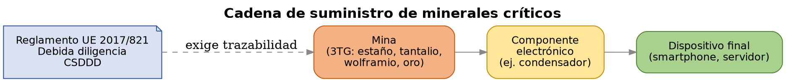
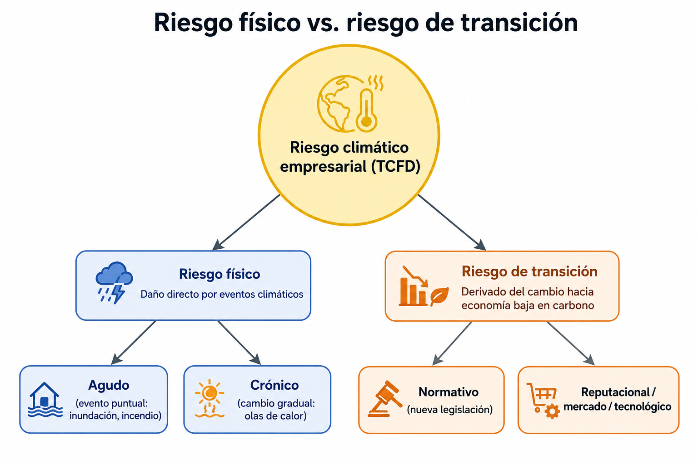
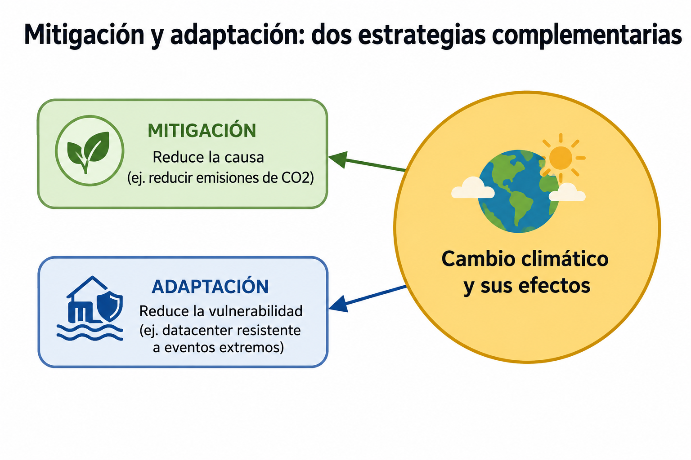

# UD2 — Retos ambientales y sociales

---

## 1. Los grandes retos ambientales globales

### 1.1 Cambio climático

El **IPCC** (Panel Intergubernamental sobre el Cambio Climático, ONU) es el organismo científico de referencia mundial. Sus informes de evaluación (el sexto, AR6, publicado en 2021-2023) confirman con un nivel de certeza superior al 95% que el calentamiento global observado desde mediados del siglo XX es de origen humano, principalmente por la emisión de gases de efecto invernadero (CO₂, metano, óxido nitroso) derivados de la quema de combustibles fósiles.

El IPCC trabaja con **escenarios de emisiones** (antes RCP, ahora SSP — *Shared Socioeconomic Pathways*) que proyectan distintos futuros climáticos según la trayectoria de emisiones que sigamos: desde escenarios de mitigación fuerte (compatibles con 1,5-2°C) hasta escenarios de altas emisiones (más de 4°C de calentamiento hacia 2100).

### 1.2 Pérdida de biodiversidad

El informe de la **IPBES** (Plataforma Intergubernamental Científico-Normativa sobre Diversidad Biológica y Servicios de los Ecosistemas) de 2019 alertó de que alrededor de un millón de especies están en riesgo de extinción, muchas en décadas. Los científicos hablan de una **sexta extinción masiva**, esta vez causada por la actividad humana (pérdida de hábitat, sobreexplotación, contaminación, especies invasoras y cambio climático).

### 1.3 Contaminación (aire, agua, suelo)

La contaminación atmosférica es, según la Organización Mundial de la Salud, uno de los mayores riesgos ambientales para la salud humana. La contaminación del agua (vertidos industriales y agrícolas) y del suelo (residuos, plásticos, químicos persistentes) completan el cuadro de las tres grandes vías de contaminación ambiental.

### 1.4 Estrés hídrico y escasez de agua

El **estrés hídrico** se produce cuando la demanda de agua de una región supera la disponibilidad sostenible de sus recursos hídricos. Según Naciones Unidas, una parte creciente de la población mundial vive ya en zonas de estrés hídrico alto, una cifra en aumento por el cambio climático y el crecimiento demográfico. Este reto tiene relación directa con la industria (incluidos los centros de datos, que usan agua para refrigeración).

### 1.5 Agotamiento de recursos naturales y materias primas críticas

La Unión Europea mantiene una lista de **materias primas críticas** (litio, cobalto, tierras raras, wolframio, entre otras) — materiales esenciales para la industria (incluida la electrónica) cuyo suministro está concentrado en pocos países y presenta riesgo geopolítico y ambiental en su extracción.

## 2. Los grandes retos sociales

### 2.1 Desigualdad y pobreza

La desigualdad se mide habitualmente con el **índice de Gini** (0 = igualdad perfecta, 1 = desigualdad máxima). A pesar de la reducción global de la pobreza extrema en las últimas décadas, la desigualdad entre países y dentro de cada país sigue siendo uno de los grandes retos sociales (ODS 1 y ODS 10).

### 2.2 Brecha digital

La **brecha digital** es la desigualdad en el acceso y uso de las tecnologías de la información. Tiene varias capas:

- **Brecha de acceso** — quién tiene o no conexión y dispositivos.
- **Brecha de uso** — quién sabe aprovechar la tecnología de forma efectiva (alfabetización digital).
- **Brecha de calidad** — diferencias en la velocidad, fiabilidad y seguridad del acceso.

Es un reto especialmente relevante para el perfil TIC, que a menudo diseña o administra la infraestructura que determina quién queda dentro o fuera de esa brecha.

### 2.3 Migraciones climáticas

El cambio climático (sequías, inundaciones, subida del nivel del mar) es ya un factor de desplazamiento de población, dentro y entre países. El Banco Mundial estima decenas de millones de "migrantes climáticos internos" hacia mediados de siglo si no se actúa sobre las causas y la adaptación.

### 2.4 Derechos laborales en cadenas de suministro globales — el caso del sector TIC

La fabricación de dispositivos electrónicos depende de cadenas de suministro globales con puntos críticos en materia de derechos laborales y ambientales:

- **Minerales de conflicto:** el término se refiere a minerales (estaño, tantalio, wolframio, oro — conocidos como "3TG") extraídos en zonas de conflicto armado, cuya venta puede financiar grupos armados. El coltán (mineral del que se extrae el tantalio, usado en condensadores de dispositivos electrónicos) procedente de la República Democrática del Congo es el caso más citado.
- **Condiciones laborales en la fabricación:** las plantas de ensamblaje de dispositivos electrónicos (memoria histórica del caso Foxconn, proveedor de Apple y otras marcas, en China) han sido objeto de escrutinio por jornadas laborales extensas y condiciones de trabajo cuestionadas.
- **Regulación en respuesta:** el Reglamento (UE) 2017/821 sobre minerales de zonas en conflicto obliga a la debida diligencia en la cadena de suministro de importadores europeos de 3TG y oro.

*Foto: Julien Harneis, [CC BY-SA 2.0](https://creativecommons.org/licenses/by-sa/2.0/), vía [Wikimedia Commons](https://commons.wikimedia.org/wiki/File:Wolframite_Mining_in_Kailo2,_DRC.jpg)*

## 3. Impactos sobre personas y sectores productivos

### 3.1 Riesgo físico vs. riesgo de transición

El marco de referencia más usado para clasificar el riesgo climático empresarial es el del **TCFD** (Task Force on Climate-related Financial Disclosures):

- **Riesgo físico** — daño directo por eventos climáticos: inundaciones, olas de calor, incendios, subida del nivel del mar. Puede ser agudo (un evento extremo puntual) o crónico (cambio gradual de patrones climáticos).
- **Riesgo de transición** — riesgo derivado del propio proceso de cambio hacia una economía baja en carbono: cambios normativos, cambios de mercado, riesgo reputacional, obsolescencia tecnológica.

### 3.2 Ejemplos por sector

| Sector | Riesgo físico | Riesgo de transición |
|---|---|---|
| Agricultura | Sequías, pérdida de cosechas | Cambios en subvenciones, nuevas normativas de uso de suelo |
| Energía | Daños en infraestructura por eventos extremos | Descarbonización, caída de demanda de combustibles fósiles |
| Turismo | Pérdida de playas, olas de calor | Cambios en preferencias de destino, impuestos verdes |
| **TIC** | Daños en centros de datos por inundación/calor extremo, cortes de suministro eléctrico | Normativa de eficiencia energética (CSRD, taxonomía verde), presión de clientes por proveedores "verdes" |

### 3.3 El caso del sector TIC

- **Riesgo físico sobre infraestructura:** los centros de datos son sensibles a eventos climáticos extremos (inundaciones, olas de calor que fuerzan la refrigeración al límite, cortes eléctricos). La ubicación de un centro de datos es hoy una decisión que incorpora análisis de riesgo climático, no solo criterios de coste o conectividad.
- **Materias primas críticas:** litio y cobalto (baterías), tierras raras (imanes, pantallas), cobre (cableado) — su extracción tiene fuerte impacto ambiental y, en algunos casos, social (condiciones laborales en minas).
- **Trabajo remoto y brecha digital:** la posibilidad de trabajar en remoto (gestión de acceso remoto, VPN, escritorios virtuales) reduce el impacto ambiental de los desplazamientos, pero solo beneficia a quien tiene acceso a una conexión y equipo adecuados — puede reducir un reto ambiental mientras amplía uno social si no se gestiona con criterio de inclusión.

## 4. Estrategias y acciones para minimizar impactos

### 4.1 Mitigación vs. adaptación

- **Mitigación** — acciones que reducen la causa del problema (ej. reducir emisiones de CO₂).
- **Adaptación** — acciones que reducen la vulnerabilidad ante un impacto que ya es inevitable o muy probable (ej. diseñar un centro de datos para resistir eventos climáticos extremos).

Ambas son necesarias y complementarias: no toda la mitigación posible evitará ya cierto grado de cambio climático, así que la adaptación es también parte de una estrategia de sostenibilidad seria.

### 4.2 Responsabilidad Social Corporativa (RSC) y su evolución hacia ASG

La **RSC** es el antecedente histórico de los criterios ASG: un conjunto de compromisos voluntarios de las empresas para gestionar su impacto social y ambiental, típicamente sin obligación normativa ni auditoría externa estandarizada. Los criterios ASG (ver UD1) representan la evolución de la RSC hacia un marco medible, comparable y, cada vez más, de obligado cumplimiento (CSRD).

### 4.3 Debida diligencia en derechos humanos

La **CSDDD** (Corporate Sustainability Due Diligence Directive, Directiva (UE) 2024/1760) obliga a las grandes empresas europeas a identificar, prevenir y mitigar impactos negativos sobre los derechos humanos y el medio ambiente a lo largo de toda su cadena de valor — no solo en sus propias operaciones, sino también en proveedores y subcontratas.

### 4.4 Estrategias específicas del sector TIC

- **Sourcing responsable de minerales:** exigir certificación de origen (ej. programas como el de la *Responsible Minerals Initiative*) a proveedores de componentes.
- **Extensión de la vida útil del hardware:** reparabilidad, actualización de componentes, reutilización de equipos (conecta con la economía circular de UD4).
- **Políticas de acceso remoto inclusivas:** diseñar el teletrabajo y el acceso remoto de forma que reduzca el impacto ambiental sin dejar fuera a quien tiene peor conectividad o equipamiento.
- **Planes de continuidad de negocio ante riesgo físico climático:** redundancia geográfica de centros de datos, criterios de ubicación que consideren riesgo climático a largo plazo.

---

## Glosario

- **IPCC:** Panel Intergubernamental sobre el Cambio Climático, referencia científica mundial en clima.
- **IPBES:** organismo equivalente al IPCC para biodiversidad y ecosistemas.
- **Estrés hídrico:** situación en la que la demanda de agua supera la disponibilidad sostenible.
- **Materias primas críticas:** materiales esenciales para la industria con alto riesgo de suministro (litio, cobalto, tierras raras...).
- **Minerales de conflicto (3TG):** estaño, tantalio, wolframio y oro extraídos en zonas de conflicto armado.
- **TCFD:** marco de referencia para clasificar riesgo climático empresarial en riesgo físico y riesgo de transición.
- **Mitigación / adaptación:** reducir la causa de un problema climático / reducir la vulnerabilidad ante sus efectos.
- **RSC:** Responsabilidad Social Corporativa, antecedente voluntario de los criterios ASG.
- **CSDDD:** directiva europea de debida diligencia en derechos humanos y medio ambiente en toda la cadena de valor.

---

## Actividades

**Actividad 1 — Investigación de un reto ambiental y uno social.**
En grupos, elegid un reto ambiental (punto 1) y un reto social (punto 2). Buscad un dato cuantitativo reciente y fiable para cada uno (organismo de referencia: IPCC, IPBES, ONU, Banco Mundial...) y preparad una presentación breve explicando por qué ese reto es relevante para el sector TIC.

**Actividad 2 — El origen de un smartphone o un servidor.**
En grupo, elegid un dispositivo (smartphone, portátil o servidor) y trazad, con la información disponible públicamente, el origen de al menos tres de sus materiales críticos (litio, cobalto, tantalio, tierras raras...). Identificad qué normativa (Reglamento UE 2017/821, CSDDD) sería aplicable a la empresa fabricante.

**Actividad 3 — Diseño de una política de acceso remoto.**
En grupo, diseñad los criterios de una política de teletrabajo/acceso remoto para una empresa TIC, evaluando: (a) el beneficio ambiental (reducción de desplazamientos), (b) el riesgo social de dejar a alguien fuera por brecha digital, y (c) al menos una medida concreta para mitigar ese riesgo.

**Actividad 4 — ¿Dónde ubicar un centro de datos?**
En grupo, debatid la ubicación de un nuevo centro de datos considerando riesgo físico (inundación, ola de calor, disponibilidad de agua para refrigeración) y riesgo de transición (normativa de eficiencia energética, coste de energía renovable disponible en la zona). Justificad vuestra elección de ubicación con al menos dos criterios de cada tipo de riesgo.

**Actividad 5 — Propuesta de acciones (cierre de unidad).**
De forma individual, elige uno de los retos trabajados en la unidad (ambiental o social) y propone tres acciones concretas para minimizarlo desde el rol de un profesional de administración de sistemas, indicando si cada acción es de mitigación o de adaptación, y con qué marco (RSC, ASG, CSDDD...) se relaciona.
