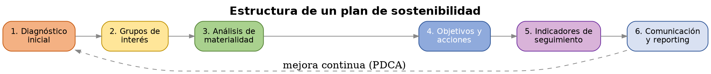
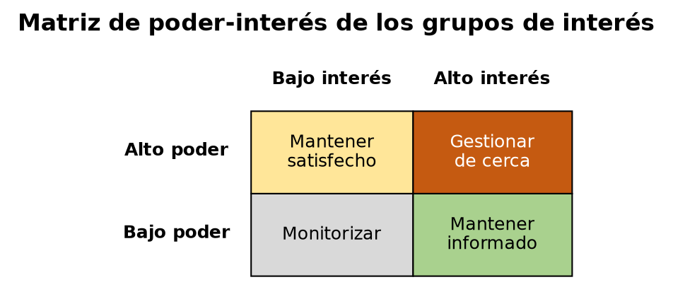
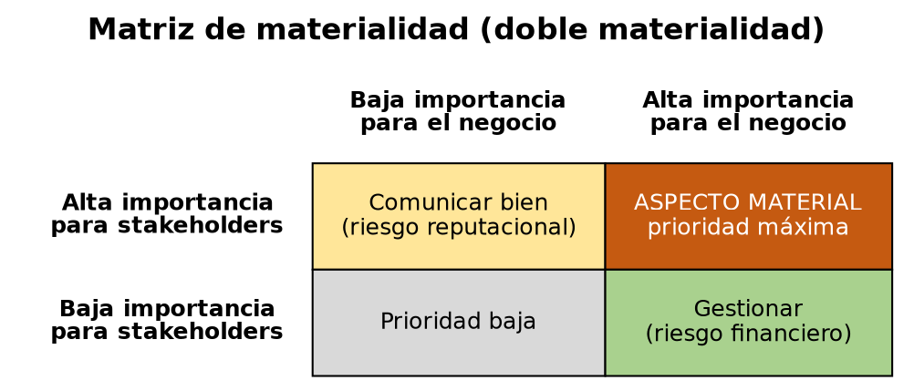

# UD6 — El plan de sostenibilidad

**Módulo:** 1708 Sostenibilidad aplicada al sistema productivo

*Foto: Luis Argerich, [CC BY 2.0](https://creativecommons.org/licenses/by/2.0/), vía [Wikimedia Commons](https://commons.wikimedia.org/wiki/File:Meeting_room,_table_and_paper_board.jpg)*

---

## 1. Qué es un plan de sostenibilidad empresarial

Un **plan de sostenibilidad** es el documento en el que una organización recoge, de forma sistemática, cómo va a gestionar sus aspectos ASG (ambientales, sociales y de gobernanza — ver UD1). No es una declaración de intenciones: es una herramienta de gestión con estructura y seguimiento, comparable en rigor a un plan de negocio.

Estructura habitual de un plan de sostenibilidad:

1. **Diagnóstico inicial** — situación de partida de la organización en materia ASG (qué se está haciendo ya, qué datos existen, qué carencias hay).
2. **Identificación de grupos de interés** (punto 2 de esta unidad).
3. **Análisis de materialidad** — qué aspectos ASG son realmente prioritarios para esta organización concreta (punto 3).
4. **Definición de objetivos y acciones** — qué se va a hacer respecto a cada aspecto material (punto 5).
5. **Indicadores de seguimiento** — cómo se va a medir el progreso (punto 4).
6. **Comunicación y reporting** — cómo se informa del avance, tanto internamente como a terceros (enlaza con la CSRD vista en UD1, si la organización está obligada a reportar).

Esta estructura sigue una lógica de mejora continua muy similar al ciclo **PDCA** (Plan-Do-Check-Act) de la norma ISO 14001 vista en UD1: planificar (diagnóstico + objetivos), hacer (ejecutar las acciones), verificar (medir con indicadores) y actuar (ajustar el plan según los resultados).

## 2. Grupos de interés (stakeholders)

Un **grupo de interés (stakeholder)** es cualquier persona, colectivo u organización que se ve afectado por la actividad de una organización, o que puede influir en ella.

### 2.1 Tipos de grupos de interés

| Tipo | Ejemplos |
|---|---|
| **Internos** | Personal empleado, dirección, accionistas/propietarios |
| **Externos — relación directa** | Clientes, proveedores, socios comerciales |
| **Externos — relación indirecta** | Comunidad local, administraciones públicas, medios de comunicación, competidores |
| **No humanos (representación indirecta)** | Medio ambiente, generaciones futuras — no "hablan" por sí mismos, pero un plan de sostenibilidad serio los debe considerar |

### 2.2 Matriz de poder-interés

Como no todos los grupos de interés tienen la misma relevancia para las decisiones de la organización, se usa habitualmente una **matriz de poder-interés** para priorizar cómo relacionarse con cada uno:

| | Bajo interés | Alto interés |
|---|---|---|
| **Alto poder** | Mantener satisfecho | Gestionar de cerca (prioridad máxima) |
| **Bajo poder** | Monitorizar (esfuerzo mínimo) | Mantener informado |

Aplicado a una infraestructura TIC: el equipo de administración de sistemas y la dirección suelen tener alto poder; los usuarios finales de los servicios y la comunidad afectada por el consumo energético del centro de datos pueden tener alto interés pero menos poder directo sobre las decisiones — el plan de sostenibilidad debe encontrar la forma de mantenerlos informados o involucrarlos, no solo gestionar a quien ya tiene poder de decisión.

### 2.3 Metodologías de consulta

Identificar a los grupos de interés no basta: un plan de sostenibilidad robusto recoge también su opinión, mediante encuestas, entrevistas o paneles de consulta — esto es lo que alimenta, en el siguiente punto, el análisis de materialidad.

## 3. Análisis de materialidad

Un **aspecto material** es aquel que es lo bastante relevante — para el negocio, para sus grupos de interés, o para ambos — como para merecer una gestión activa y prioritaria dentro del plan. No todos los aspectos ASG posibles son igual de relevantes para todas las organizaciones: una empresa de logística priorizará de forma distinta que una empresa de software.

### 3.1 Doble materialidad

Ya introducida en UD1 a propósito de la CSRD: un aspecto puede ser material desde dos perspectivas, que no siempre coinciden:

- **Materialidad financiera** — el impacto que un aspecto de sostenibilidad tiene *sobre* el negocio (ej. el riesgo físico climático sobre un centro de datos, visto en UD2, afecta directamente a la continuidad del negocio).
- **Materialidad de impacto** — el impacto que el propio negocio tiene *sobre* la sostenibilidad (ej. las emisiones de CO₂ generadas por los centros de datos de la empresa).

### 3.2 Matriz de materialidad

Herramienta habitual para visualizar y priorizar: un eje representa la importancia del aspecto para los grupos de interés (recogida mediante las metodologías de consulta del punto 2.3), y el otro eje representa la importancia del aspecto para el negocio (materialidad financiera). Los aspectos que puntúan alto en ambos ejes son los que deben encabezar el plan de sostenibilidad.

## 4. Indicadores y medición

Un plan de sostenibilidad sin indicadores es una declaración de intenciones, no una herramienta de gestión. Cada aspecto material priorizado necesita al menos un indicador que permita comprobar si se está avanzando.

### 4.1 Criterio SMART

Un buen indicador de sostenibilidad debería cumplir el criterio **SMART**:
- **S**pecífico — define con precisión qué se mide.
- **M**edible — puede cuantificarse con datos verificables.
- **A**lcanzable — el objetivo asociado es realista.
- **R**elevante — está conectado con un aspecto material real.
- **T**emporal — tiene un plazo definido.

### 4.2 Ejemplos de indicadores por dimensión ASG (aplicados a infraestructura TIC)

| Dimensión | Indicador | Ejemplo de objetivo SMART |
|---|---|---|
| Ambiental | PUE del centro de datos (ver UD1) | Reducir el PUE de 1,6 a 1,3 en 18 meses |
| Ambiental | % de energía renovable consumida | Alcanzar el 80% de energía renovable en 2 años |
| Social | % de equipos reacondicionados frente a nuevos (ver UD4) | Que el 30% del hardware adquirido sea reacondicionado en 1 año |
| Gobernanza | Nº de incidentes de seguridad/privacidad reportados | Reducir un 50% los incidentes de acceso no autorizado en 1 año |

### 4.3 Relación con estándares de reporting

Los indicadores de un plan de sostenibilidad no se inventan desde cero: conviene alinearlos, cuando sea posible, con estándares reconocidos (GRI, o los ESRS de la CSRD vistos en UD1) — esto facilita comparar el desempeño de la organización con el de otras, y prepara el terreno para un reporting formal si la organización llega a estar obligada a él.

## 5. Diseño y justificación de acciones de gestión

Para cada aspecto material priorizado, el plan debe definir una o varias acciones concretas, con esta estructura mínima:

- **Qué se va a hacer** (la acción en sí).
- **Quién es responsable** de ejecutarla.
- **Con qué recursos** cuenta (presupuesto, herramientas, personal).
- **En qué plazo**.
- **Con qué indicador** se medirá su éxito (del punto 4).

La justificación de cada acción debe conectar explícitamente con el aspecto material del que parte — una acción sin esa trazabilidad (por qué esta acción, para qué aspecto material, medida cómo) es una buena intención suelta, no parte de un plan.

## 6. El plan de sostenibilidad aplicado a una infraestructura TIC

Todo lo anterior se puede aplicar directamente a una infraestructura de sistemas real — como la que habéis diseñado a lo largo del curso en ASO (servicio de directorio, scripts de automatización, gestión de accesos):

- **Diagnóstico:** ¿qué datos de consumo, uso de recursos o gestión de accesos genera ya esa infraestructura? (mucho de este dato ya lo habéis generado en UD1 y UD3).
- **Grupos de interés:** ¿quién usa, administra o se ve afectado por esa infraestructura? (usuarios, administradores del sistema, la organización que la financia).
- **Aspectos materiales:** de todo lo visto en UD1-UD4 (consumo energético, gestión de licencias, ciclo de vida del hardware, gestión de accesos), ¿cuáles son los más relevantes para esa infraestructura concreta?
- **Indicadores y acciones:** ¿qué se mediría y qué se haría para mejorar cada aspecto material identificado?

Esta unidad cierra el módulo aplicando, sobre un caso concreto, todo el recorrido de las unidades anteriores.

---

## Glosario

- **Plan de sostenibilidad:** documento de gestión sistemática de los aspectos ASG de una organización, con diagnóstico, objetivos, acciones e indicadores.
- **Grupo de interés (stakeholder):** persona, colectivo u organización afectado por la actividad de una organización o que puede influir en ella.
- **Matriz de poder-interés:** herramienta de priorización de grupos de interés según su poder de influencia y su nivel de interés.
- **Aspecto material:** aspecto ASG suficientemente relevante para el negocio y/o sus grupos de interés como para requerir gestión prioritaria.
- **Doble materialidad:** materialidad financiera (impacto de la sostenibilidad sobre el negocio) + materialidad de impacto (impacto del negocio sobre la sostenibilidad).
- **Matriz de materialidad:** herramienta visual para priorizar aspectos según su relevancia para el negocio y para los grupos de interés.
- **Criterio SMART:** Específico, Medible, Alcanzable, Relevante, Temporal — criterio de calidad de un buen indicador u objetivo.

---

## Actividades

**Actividad 0 — Analizar un plan de sostenibilidad real (preparación).**
Antes de diseñar vuestro propio plan, entrad en la web corporativa de una gran empresa española (por ejemplo, CEPSA, Repsol o Endesa — todas publican su plan de sostenibilidad en abierto) y descargad su plan de sostenibilidad público. Identificad en él las mismas piezas vistas en el punto 1: ¿qué diagnóstico plantean?, ¿mencionan explícitamente a sus grupos de interés?, ¿qué aspectos priorizan?, ¿qué indicadores usan? Esto os servirá de referencia real antes de aplicar la misma lógica a vuestra propia infraestructura en la Actividad 4.

**Actividad 1 — Mapa de grupos de interés.**
En grupo, identificad los grupos de interés de la infraestructura TIC que habéis diseñado en ASO (o de una empresa TIC real, si se prefiere un caso ajeno). Clasificadlos en la matriz de poder-interés del punto 2.2 y justificad, para cada cuadrante, cómo debería relacionarse la organización con ese grupo.

**Actividad 2 — Matriz de materialidad.**
En grupo, a partir de los aspectos ASG trabajados en UD1-UD4 (consumo energético, gestión de licencias, ciclo de vida del hardware, gestión de accesos, brecha digital...), situad al menos 6 aspectos en una matriz de materialidad (importancia para el negocio / importancia para los grupos de interés) y determinad cuáles serían prioritarios para vuestro plan.

**Actividad 3 — Indicadores SMART.**
Para los 3 aspectos materiales que hayáis priorizado en la Actividad 2, diseñad un indicador SMART para cada uno, siguiendo la tabla del punto 4.2 como modelo.

**Actividad 4 — Plan de sostenibilidad de la infraestructura del proyecto final (cierre de unidad y del módulo, evaluable).**
De forma individual o en grupo (según se acuerde con el proyecto final de ASO), redactad el plan de sostenibilidad completo de la infraestructura desarrollada a lo largo del curso, siguiendo la estructura del punto 1: diagnóstico, grupos de interés (Actividad 1), aspectos materiales priorizados (Actividad 2), indicadores (Actividad 3) y al menos 3 acciones concretas con responsable, recursos, plazo e indicador de seguimiento.
