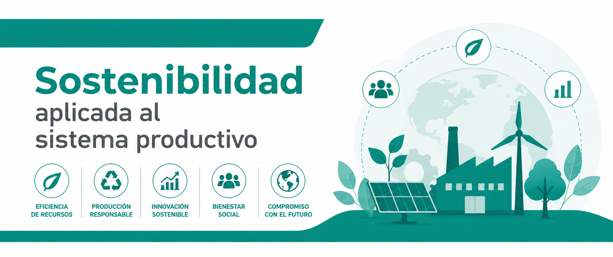

---
hide:
  - navigation
---

**Módulo 1708** · Ciclo Administración de Sistemas Informáticos en Red — apuntes integrados con el módulo de Administración de Sistemas Operativos (ASO).

Estas unidades didácticas acompañan, semana a semana, a los contenidos técnicos de ASO: cada UD mira la misma infraestructura desde la perspectiva de la sostenibilidad (ambiental, social y de gobernanza).

- [UD1. Sostenibilidad, ASG y marcos internacionales](ud1.md)
- [UD2. Retos ambientales y sociales](ud2.md)
- [UD3. Los ODS en el desempeño profesional](ud3.md)
- [UD4. Economía circular](ud4.md)
- [UD5. Actividades sostenibles (Formación en empresa)](ud5.md)
- [UD6. El plan de sostenibilidad](ud6.md)

## Resultados de aprendizaje

Cada unidad desarrolla uno de los resultados de aprendizaje (RA) del currículo del módulo 1708. La última columna indica su ponderación en la nota final del módulo:

| Unidad | Resultado de aprendizaje | Ponderación |
| --- | --- | :---: |
| [UD1](ud1.md) | **RA1** — Identificar los aspectos ambientales, sociales y de gobernanza (ASG) de la sostenibilidad y los marcos internacionales que contribuyen a su consecución. | 20 % |
| [UD2](ud2.md) | **RA2** — Caracterizar los retos ambientales y sociales, describir sus impactos sobre las personas y los sectores productivos y proponer acciones para minimizarlos. | 20 % |
| [UD3](ud3.md) | **RA3** — Aplicar criterios de sostenibilidad en el desempeño profesional y personal, identificando los elementos necesarios. | 20 % |
| [UD4](ud4.md) | **RA4** — Proponer productos y servicios responsables teniendo en cuenta los principios de la economía circular. | 20 % |
| [UD5](ud5.md) | **RA5** — Realizar actividades sostenibles minimizando su impacto en el medio ambiente. | 10 % |
| [UD6](ud6.md) | **RA6** — Analizar el plan de sostenibilidad de una empresa del sector, identificando sus grupos de interés y los aspectos ASG materiales y justificando acciones para su gestión y medición. | 10 % |
| | **Total** | **100 %** |
