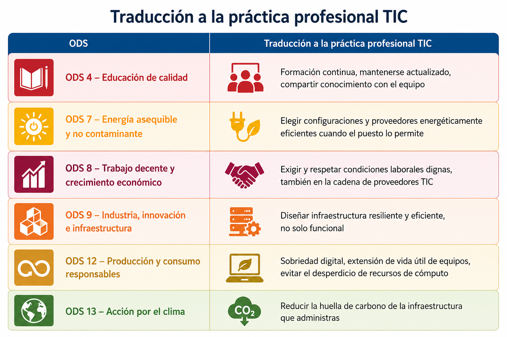
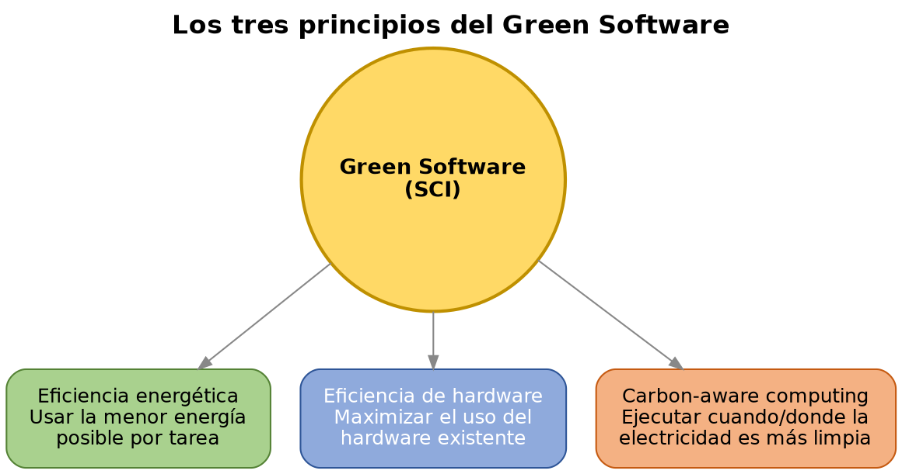
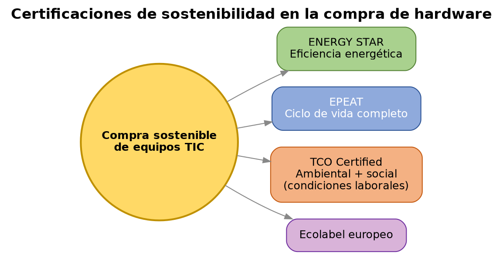
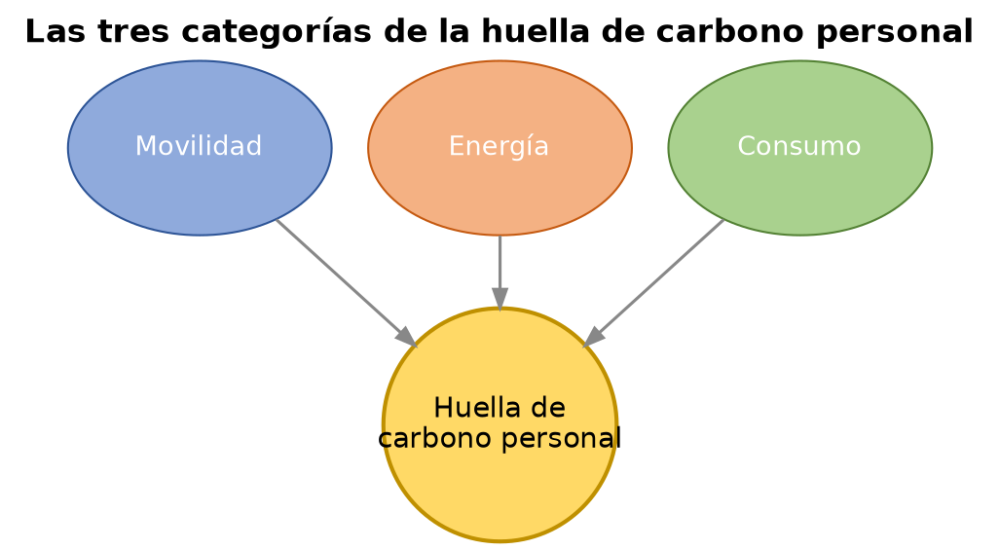

# UD3 — Los ODS en el desempeño profesional

---

## 1. De los ODS al desempeño profesional individual

En UD1 vimos los ODS como marco internacional (Agenda 2030). En esta unidad bajamos ese marco a la escala del puesto de trabajo: ¿qué significa, en el día a día de un profesional de administración de sistemas, contribuir a esos objetivos?

**Idea clave:** un profesional no necesita cambiar de sector para actuar sobre los ODS — la mayoría de sus contribuciones posibles están dentro de las decisiones técnicas cotidianas de su propio puesto.

## 2. Sostenibilidad en el puesto de trabajo TIC

### 2.1 Green Software y sobriedad digital

El **Green Software** (o *Software sostenible*) es la disciplina que estudia cómo diseñar y operar software para minimizar su huella de carbono. La **Green Software Foundation** (fundación sin ánimo de lucro con participación de Microsoft, GitHub, Accenture, entre otros) ha popularizado el indicador **SCI (Software Carbon Intensity)**, que mide las emisiones de carbono asociadas a ejecutar una unidad de software.

Principios básicos del Green Software aplicables al perfil de administración de sistemas:

- **Eficiencia energética:** usar la menor cantidad de energía posible para completar una tarea (código optimizado, procesos bien programados).
- **Eficiencia de hardware:** maximizar el uso del hardware disponible antes de aprovisionar más (evitar servidores infrautilizados).
- **Consciencia de la huella de carbono:** ejecutar cargas de trabajo, cuando sea posible, en momentos o regiones donde la electricidad de la red proviene en mayor proporción de fuentes renovables (*carbon-aware computing*).

La **sobriedad digital** (digital sobriety) es el principio, más amplio, de consumir solo los recursos digitales necesarios: evitar el almacenamiento innecesario de datos duplicados, evitar el envío de correos con adjuntos pesados fácilmente evitables, el streaming en calidad superior a la necesaria, o mantener servicios en ejecución sin uso real.

### 2.2 Buenas prácticas técnicas con impacto en sostenibilidad

- **Virtualización y consolidación:** varios servicios en menos máquinas físicas reduce el consumo total (ya visto en UD1).
- **Apagado y suspensión programados:** equipos y servicios que no necesitan estar activos 24/7 (entornos de pruebas, estaciones de trabajo fuera de horario).
- **Gestión del ciclo de vida de los datos:** políticas de retención y borrado de datos que ya no aportan valor, en vez de almacenamiento indefinido "por si acaso".
- **Automatización de tareas repetitivas:** reduce errores humanos que generan reprocesos, y permite aplicar configuraciones eficientes de forma consistente en muchos sistemas a la vez (ver punto 4).

## 3. Compras sostenibles y TIC responsable

Cuando un profesional participa en decisiones de adquisición de hardware, existen criterios y certificaciones que permiten comparar opciones de forma objetiva:

| Etiqueta / certificación | Qué garantiza |
|---|---|
| **ENERGY STAR** | Eficiencia energética del equipo, certificación de origen estadounidense (EPA) adoptada internacionalmente |
| **EPEAT** (Electronic Product Environmental Assessment Tool) | Evaluación ambiental del ciclo de vida completo del producto: materiales, diseño, eficiencia energética, fin de vida |
| **TCO Certified** | Certificación sueca que evalúa criterios ambientales y también sociales (condiciones laborales en la fabricación) |
| **Ecolabel europeo** | Etiqueta ecológica de la UE aplicable también a equipos electrónicos |

Un criterio de compra sostenible no se limita al precio de adquisición: incorpora el **coste total de propiedad** (consumo energético durante la vida útil del equipo) y la posibilidad de reparación, ampliación o reventa/reciclaje al final de su vida útil (conexión directa con la economía circular de UD4).

## 4. Automatización como práctica profesional sostenible

La automatización de infraestructura (herramientas como Ansible, ya trabajadas en ASO) tiene una dimensión de sostenibilidad que a menudo pasa desapercibida:

- **Reduce errores de configuración** que llevan a sistemas mal dimensionados o mal optimizados (y por tanto, a un consumo de recursos mayor del necesario).
- **Permite aplicar políticas de eficiencia de forma consistente** en muchos servidores a la vez (por ejemplo, un playbook que homogeneiza la configuración de ahorro de energía en todo un parque de servidores, en vez de configurarlo manualmente máquina a máquina, con el riesgo de que algunas queden mal configuradas).
- **Facilita el apagado/encendido programado** de entornos que no necesitan estar activos permanentemente (entornos de desarrollo o pruebas).
- **Documenta y versiona la infraestructura** (Infraestructura como Código), lo que facilita auditar qué recursos existen realmente y detectar recursos "huérfanos" que siguen consumiendo sin uso activo.

## 5. Competencias y certificaciones profesionales en sostenibilidad

El perfil de sostenibilidad aplicada a TIC está generando nuevas figuras profesionales y certificaciones:

- **Especialista en Green IT / Sustainable IT:** perfil centrado en optimizar el impacto ambiental de la infraestructura tecnológica.
- **Auditor/a ISO 14001:** formación para auditar sistemas de gestión ambiental (ver UD1).
- **Certificaciones de la Green Software Foundation:** formación específica en prácticas de software sostenible.
- **Analista de sostenibilidad / ASG:** perfil más generalista, cada vez más demandado por la obligación de reporting bajo CSRD (ver UD1).

Para un profesional de administración de sistemas, no hace falta cambiar de perfil para incorporar esta dimensión: se trata de añadir el criterio de sostenibilidad a las decisiones técnicas que ya se toman de forma habitual (dimensionamiento, virtualización, automatización, elección de proveedores).

## 6. Sostenibilidad personal: hábitos y huella de carbono individual

{ width="360" }
*Foto: Shixart1985, [CC BY 2.0](https://creativecommons.org/licenses/by/2.0/), vía [Wikimedia Commons](https://commons.wikimedia.org/wiki/File:Attractuve_middle-aged_woman_working_on_laptop_at_home.jpg)*

La **huella de carbono personal** se calcula habitualmente en tres grandes categorías:

- **Movilidad** — desplazamientos al trabajo, viajes.
- **Energía** — consumo doméstico de electricidad, calefacción/refrigeración.
- **Consumo** — bienes y servicios adquiridos, incluido el consumo digital (streaming, almacenamiento en la nube, dispositivos).

El **teletrabajo y el acceso remoto** (visto en UD2 desde la perspectiva de riesgo/impacto sectorial) son también, a escala individual, una de las palancas más directas que tiene un profesional TIC para reducir su propia huella de movilidad — con la misma salvedad ya señalada en UD2: solo es una mejora neta si no perpetúa la brecha digital de quien no puede acceder a esa modalidad.

Más allá de la huella personal, un profesional puede influir en la **cultura de sostenibilidad de su organización** desde su propio puesto: proponiendo criterios de eficiencia en las decisiones técnicas del equipo, señalando buenas prácticas, o participando en la definición de políticas internas de TIC responsable.

---

## Glosario

- **Green Software / SCI:** disciplina y métrica (Software Carbon Intensity) para medir la huella de carbono del software.
- **Sobriedad digital:** principio de consumir solo los recursos digitales necesarios.
- **Carbon-aware computing:** ejecutar cargas de trabajo cuando/donde la electricidad es más limpia.
- **EPEAT / TCO Certified / ENERGY STAR:** certificaciones y etiquetas de sostenibilidad de equipos electrónicos.
- **Coste total de propiedad:** coste de un equipo incluyendo consumo energético y vida útil, no solo el precio de compra.
- **Infraestructura como Código (IaC):** gestión de infraestructura mediante código versionado y automatizable (ej. Ansible).
- **Huella de carbono personal:** estimación de las emisiones de GEI asociadas a la actividad de una persona (movilidad, energía, consumo).

---

## Actividades

<strong>Actividad 1 — De los ODS a mi puesto de trabajo.</strong>

De forma individual, elige tres ODS de la tabla del punto 1 y describe una acción concreta que podrías aplicar en un puesto de administración de sistemas para contribuir a cada uno. Debe ser una acción técnica realista, no una declaración de intenciones genérica.

<strong>Actividad 2 — Comparativa de compra sostenible.</strong>

En grupo, comparad dos equipos (servidor, portátil o similar) con distintas certificaciones ambientales (ENERGY STAR, EPEAT, TCO Certified). Calculad de forma aproximada el coste total de propiedad de cada uno a 4 años, incluyendo una estimación de consumo energético, y justificad cuál recomendaríais y por qué.

<strong>Actividad 3 — Playbook de eficiencia.</strong>

En grupo, diseñad un playbook de Ansible (o su pseudocódigo/esquema, si aún no se ha visto en detalle en ASO) que aplique un criterio de sostenibilidad a un conjunto de servidores: por ejemplo, apagado programado de entornos de pruebas fuera de horario, o homogeneización de una configuración de ahorro de energía. Explicad qué problema de ineficiencia evita la automatización frente a hacerlo manualmente.

<strong>Actividad 4 — Perfiles profesionales en sostenibilidad TIC.</strong>

Investigad una oferta de empleo real (o una certificación) relacionada con sostenibilidad TIC (Green IT, auditor ISO 14001, analista ASG...). Identificad qué competencias técnicas y de sostenibilidad exige, y comparadlas con las competencias que ya estáis adquiriendo en el ciclo.

<strong>Actividad 5 — Mi plan personal de sostenibilidad profesional (cierre de unidad, evaluable).</strong>

De forma individual, redacta un breve plan con tres compromisos concretos: uno relacionado con tus hábitos digitales personales (sobriedad digital), uno relacionado con una práctica técnica que aplicarás quando administres sistemas (ej. virtualización, automatización, apagado programado), y uno relacionado con tu desarrollo profesional (formación o certificación en sostenibilidad TIC que te interesaría seguir).
