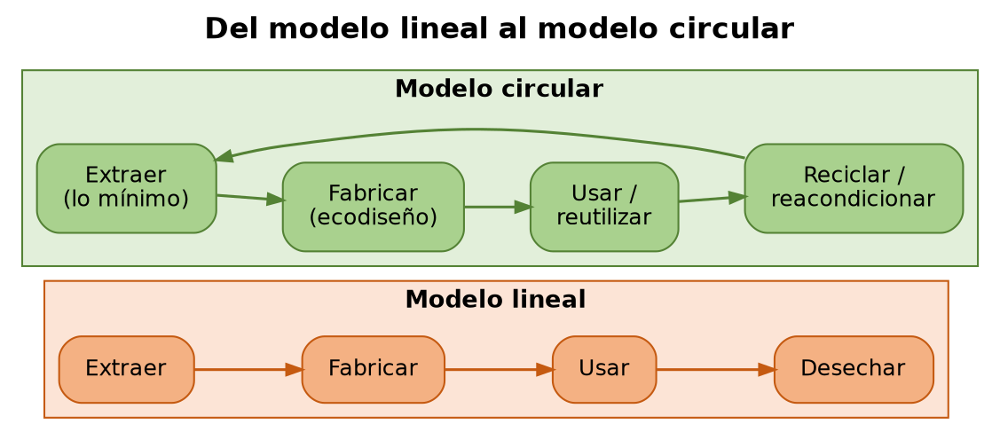
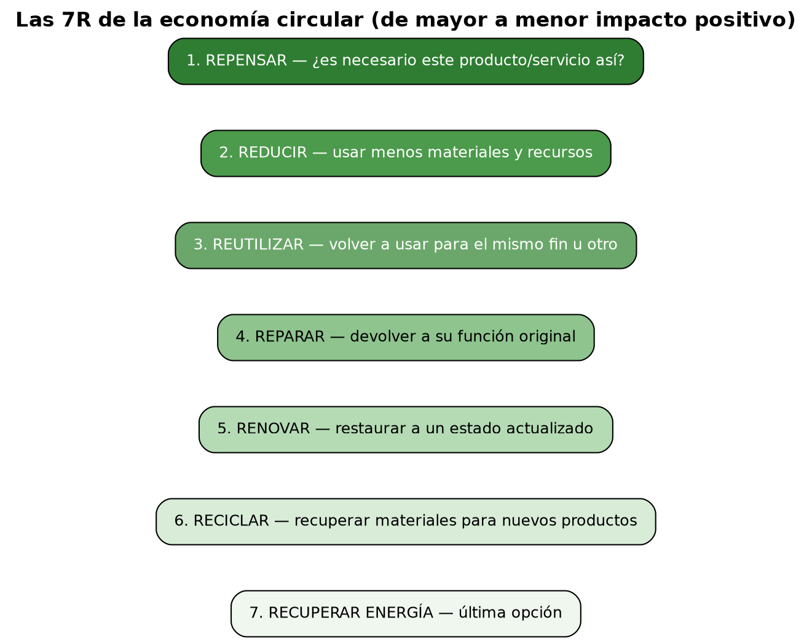
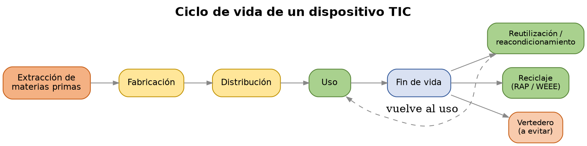
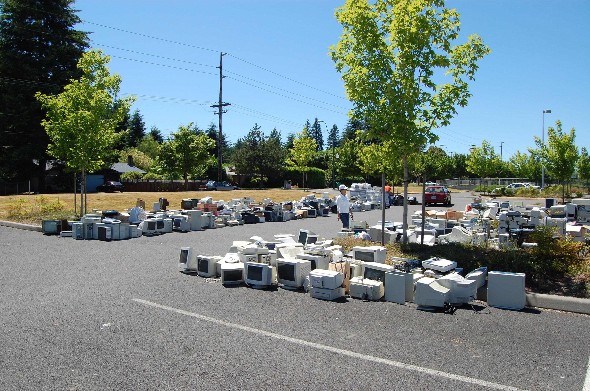

# UD4 — Economía circular

**Módulo:** 1708 Sostenibilidad aplicada al sistema productivo

---

## 1. De la economía lineal a la economía circular

### 1.1 El modelo lineal

La economía industrial se ha organizado tradicionalmente según un modelo lineal: **extraer → fabricar → usar → desechar**. Este modelo asume, implícitamente, que los recursos naturales son ilimitados y que el planeta puede absorber sin límite los residuos generados — dos asunciones que chocan con los retos vistos en UD2 (agotamiento de recursos, materias primas críticas, contaminación).

### 1.2 El modelo circular y las "R"

La **economía circular** propone un modelo alternativo en el que los materiales y productos permanecen en uso el mayor tiempo posible, y los residuos de un proceso se convierten en recursos de otro. Se suele describir mediante una jerarquía de estrategias, ordenadas de mayor a menor impacto positivo (las "R" de la economía circular):

| Estrategia | Descripción |
|---|---|
| **Repensar** | Cuestionar si el producto/servicio es necesario en su forma actual |
| **Reducir** | Usar menos materiales y recursos por unidad de producto o servicio |
| **Reutilizar** | Volver a usar un producto o componente para el mismo fin u otro |
| **Reparar** | Arreglar un producto para devolverlo a su función original |
| **Renovar / reacondicionar** | Restaurar un producto antiguo a un estado actualizado |
| **Reciclar** | Recuperar materiales de un producto al final de su vida para fabricar otros nuevos |
| **Recuperar (energía)** | Última opción: extraer energía de un residuo que no puede reciclarse |

Cuanto más arriba en esta jerarquía se actúa, mayor es el ahorro de recursos y energía — reciclar consume menos que fabricar desde cero, pero reutilizar sin siquiera reciclar consume aún menos.

### 1.3 El diagrama de mariposa

La Fundación Ellen MacArthur (referencia mundial en economía circular) representa el modelo circular con el llamado **diagrama de mariposa**: dos ciclos que salen de un mismo centro —
- **Ciclo biológico** (ala izquierda): materiales orgánicos que pueden volver de forma segura a la naturaleza (compostaje, biodegradación).
- **Ciclo técnico** (ala derecha): materiales y productos manufacturados (como el hardware TIC) que se mantienen en circulación mediante mantenimiento, reutilización, reacondicionamiento y reciclaje, sin perder valor innecesariamente.

El hardware TIC pertenece siempre al ciclo técnico: el objetivo no es que "vuelva a la tierra", sino que circule el mayor tiempo posible dentro del sistema económico antes de convertirse en residuo.

## 2. Marco normativo y estratégico de la economía circular

- **Plan de Acción de la UE para la Economía Circular** (2020) — parte del Pacto Verde Europeo (ver UD1). Establece medidas específicas para productos electrónicos, entre otros sectores prioritarios.
- **ESPR (Ecodesign for Sustainable Products Regulation)** — Reglamento (UE) 2024/1781, que sustituye y amplía la anterior Directiva de Ecodiseño. Obliga a que los productos que se comercialicen en la UE (incluidos los electrónicos) cumplan requisitos de durabilidad, reparabilidad, reciclabilidad y eficiencia de recursos desde su diseño.
- **Directiva del Derecho a Reparar** (Right to Repair Directive, (UE) 2024/1799) — obliga a los fabricantes a facilitar la reparación de productos (incluidos electrónicos) dentro y fuera del periodo de garantía, con acceso a piezas de recambio y manuales técnicos.
- **España Circular 2030** — Estrategia Española de Economía Circular, marco nacional que traslada los objetivos europeos y fija metas de reducción de generación de residuos y aumento de reutilización/reciclaje.

## 3. Economía circular aplicada al hardware TIC

### 3.1 El ciclo de vida de un dispositivo

Extracción de materias primas (incluidas las materias primas críticas vistas en UD2: litio, cobalto, tierras raras) → fabricación → distribución → uso → fin de vida (reutilización, reacondicionamiento, reciclaje o vertedero).

### 3.2 Obsolescencia programada vs. obsolescencia percibida

- **Obsolescencia programada** — diseño deliberado de un producto para que deje de funcionar o pierda rendimiento tras un periodo determinado, forzando su sustitución.
- **Obsolescencia percibida** — el producto sigue funcionando correctamente, pero factores de marketing, moda o falta de compatibilidad con software nuevo generan la sensación de que "ya no sirve".

Ambas son objeto de escrutinio normativo creciente (ver ESPR y Derecho a Reparar), precisamente porque son el principal obstáculo para que el hardware permanezca más tiempo en el ciclo técnico de la mariposa.

### 3.3 Reacondicionado y mercado de segunda mano

El **hardware reacondicionado (refurbished)** — equipos usados restaurados a un estado funcional certificado, con garantía — es una de las estrategias de mayor impacto en el sector TIC: evita la fabricación de un equipo nuevo (con su correspondiente extracción de materias primas) mientras se aprovecha un equipo que aún tiene vida útil.

### 3.4 Reciclaje y responsabilidad ampliada del productor

La **Directiva WEEE** (ya vista en UD1) establece el principio de **Responsabilidad Ampliada del Productor (RAP)**: el fabricante es responsable de la gestión de sus productos también al final de su vida útil, no solo durante la venta. Esto incluye financiar y organizar sistemas de recogida y reciclaje de aparatos electrónicos.

*Foto: Bluedisk, [CC BY-SA 3.0](https://creativecommons.org/licenses/by-sa/3.0/), vía [Wikimedia Commons](https://commons.wikimedia.org/wiki/File:Computer_Recycling.JPG)*

El reciclaje de componentes electrónicos permite recuperar metales críticos (oro, plata, cobre, y en menor medida tierras raras) que de otro modo requerirían nueva extracción minera — cerrando parcialmente el ciclo que empezó en el punto 3.1.

## 4. Economía circular aplicada al software y las licencias

La economía circular no se limita al hardware: también aplica a cómo se gestionan el software y las licencias.

- **Modelos de licenciamiento:** una licencia perpetua (se paga una vez, se usa indefinidamente) frente a una licencia por suscripción (pago recurrente, acceso mientras se paga) tienen implicaciones distintas en términos de uso eficiente — las suscripciones no usadas o infrautilizadas son un "residuo" económico y de gestión tan real como el hardware sin uso.
- **Auditoría y gestión del ciclo de vida de licencias:** identificar licencias asignadas a usuarios o equipos que ya no las necesitan (bajas de personal, equipos retirados) es una forma de "reducir" aplicada al software: evita comprar más licencias de las necesarias.
- **SaaS (Software as a Service) y recursos compartidos:** los modelos de software como servicio, ejecutados en infraestructura compartida en la nube, permiten repartir la carga de cómputo entre muchos clientes en el mismo hardware físico — una forma de maximizar el uso de un recurso (el servidor) antes de necesitar más.
- **Virtualización y contenedores:** ya vistos en UD1 como práctica de Green IT, son también una estrategia de economía circular: permiten ejecutar más carga de trabajo en el mismo hardware físico, extendiendo su vida útil efectiva antes de necesitar sustituirlo.
- **Software libre y de código abierto:** la reutilización de código ya existente (en lugar de programar todo desde cero) es, en esencia, el principio de "reutilizar" aplicado al desarrollo de software.

## 5. Diseño de productos y servicios TIC responsables

RA4 pide explícitamente "proponer productos y servicios responsables" — no solo describir el problema. Algunas estrategias de diseño que ya se aplican en el sector:

- **Ecodiseño de servicios digitales:** diseñar aplicaciones y servicios pensando en el consumo de datos y recursos que generarán en el dispositivo del usuario final, no solo en el servidor.
- **Producto como servicio (Product as a Service):** en vez de vender un equipo, la empresa lo cede en régimen de renting/leasing, manteniéndolo, actualizándolo y haciéndose cargo de su reacondicionamiento o reciclaje al final del contrato — esto alinea el incentivo del fabricante con la durabilidad del producto (cuanto más dure, menos le cuesta al fabricante mantenerlo), al contrario que en un modelo de venta tradicional.
- **Ejemplos de la industria:** modularidad y reparabilidad como argumento de producto (ej. Fairphone, diseñado explícitamente para facilitar la sustitución de piezas), programas de recompra/reciclaje de equipos de grandes fabricantes, y servicios de impresión con reposición de consumibles incluida en el propio servicio (modelo ya extendido en el sector de impresión).

---

## Glosario

- **Economía lineal / economía circular:** modelo extraer-fabricar-usar-desechar frente al modelo que mantiene materiales y productos en uso el mayor tiempo posible.
- **Las "R":** repensar, reducir, reutilizar, reparar, renovar, reciclar, recuperar — jerarquía de estrategias de economía circular.
- **Diagrama de mariposa (Ellen MacArthur Foundation):** representación del ciclo biológico y el ciclo técnico de los materiales.
- **ESPR:** reglamento europeo de ecodiseño de productos sostenibles.
- **Derecho a reparar:** directiva europea que obliga a facilitar la reparación de productos.
- **Obsolescencia programada / percibida:** fin de vida útil forzado por diseño, o por percepción de desactualización sin fallo real.
- **Reacondicionado (refurbished):** equipo usado restaurado a estado funcional certificado.
- **RAP (Responsabilidad Ampliada del Productor):** el fabricante es responsable de la gestión de sus productos al final de su vida útil.
- **Producto como servicio (PaaS/XaaS de negocio):** modelo en el que el fabricante conserva la propiedad y responsabilidad del ciclo de vida del producto, cediendo su uso.

---

## Actividades

**Actividad 1 — Del modelo lineal al modelo circular.**
En grupo, elegid un dispositivo TIC (portátil, smartphone o servidor) y dibujad su ciclo de vida completo según el modelo lineal actual. Después, rediseñad ese mismo ciclo aplicando al menos tres de las "R" vistas en el punto 1, indicando en qué fase concreta interviene cada una.

**Actividad 2 — Caso de ecodiseño y derecho a reparar.**
Investigad un producto tecnológico diseñado explícitamente para ser reparable (por ejemplo, Fairphone) y comparadlo con un producto convencional de gama similar, usando como referencia un índice de reparabilidad si está disponible (ej. iFixit). Identificad qué requisitos de la ESPR o de la Directiva del Derecho a Reparar cumpliría cada uno.

**Actividad 3 — Auditoría del ciclo de vida de licencias.**
En grupo, diseñad un script (en PowerShell, si ya lo estáis viendo en ASO) o un procedimiento detallado que audite las licencias de software instaladas/asignadas en un conjunto de equipos, identificando licencias sin uso o asignadas a cuentas de baja. Explicad qué principio de economía circular (de la lista de "R") aplica esta auditoría.

**Actividad 4 — Gestión del ciclo de vida de equipos con Directorio Activo.**
En grupo, diseñad una política de gestión de activos usando Active Directory: cómo identificar equipos próximos al fin de su vida útil, cómo marcarlos para reacondicionamiento o reciclaje, y cómo evitar "cuentas huérfanas" o equipos fantasma que sigan generando gasto de licencias o recursos sin uso real.

**Actividad 5 — Propuesta de producto o servicio circular (cierre de unidad, evaluable).**
De forma individual o en pareja, diseña una propuesta breve de un producto o servicio TIC responsable (hardware, software o servicio en la nube) que aplique al menos dos principios de economía circular de esta unidad. Debe incluir: qué problema del modelo lineal resuelve, qué estrategia circular aplica, y a qué normativa (ESPR, Derecho a Reparar, WEEE) respondería si existiera hoy en el mercado.
